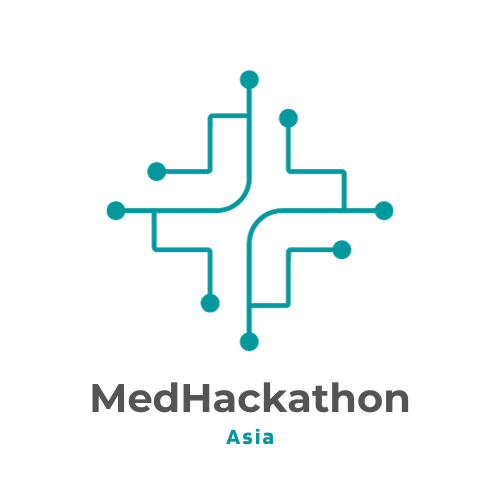

<!-- centering markdown images -->

  

# MedHackathon 2025

## Background

The diversity in Asian genomic data holds immense potential to enhance our understanding of human genetics globally. However, there is currently a lack of communication and collaboration among national genome projects in various Asian countries. This fragmentation undermines the potential benefits that each country's unique efforts and resources can bring to the field of medical informatics. By fostering better communication and collaboration, we can raise the value and impact of individual national projects, ultimately contributing to a more comprehensive and inclusive understanding of human genetics.

## Objectives

The primary objective of the MedHackathon is to establish a robust networking platform for medical informatics researchers across Asia. By bringing together experts from diverse backgrounds, the event aims to foster collaboration and facilitate the exchange of knowledge and experiences. This collective effort is intended to build a cohesive community that respects and values the unique contributions of each country. Through enhanced networking, the event seeks to bridge the existing communication gaps and create a unified approach to advancing medical informatics research in the region.

## Expected outcomes

- Enhanced sharing of knowledge and experiences among medical informatics researchers in Asia.
- Formation of a diverse and inclusive community that respects each country's decisions and contributions.
- Improved communication and collaboration among national genome projects in Asian countries.
- Elevated value and impact of individual national efforts in medical informatics.
- Strengthened regional capacity to contribute to global human genetics research.

## Possible Hackathon Products

- A centralized data catalog for medical and genomic datasets from participating countries.
- A comprehensive report or database on privacy protection laws in each country.
- Standardized metadata templates for genomic and medical data.
- A reference panel for genomic data that can be used by researchers across Asia.
- Documentation and guidelines for best practices in medical informatics research.

## Tentative Schedule

3-7 February 2025

## Tentative place

Buri, Chonburi, Thailand

